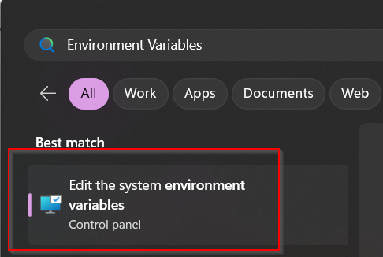
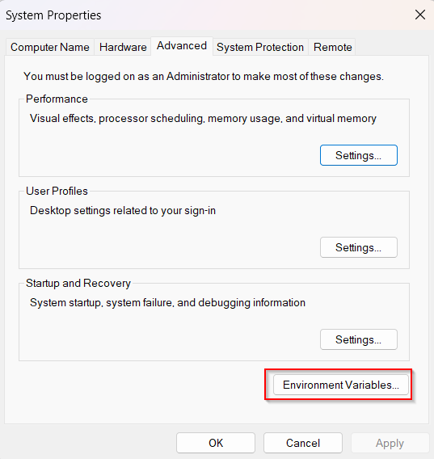
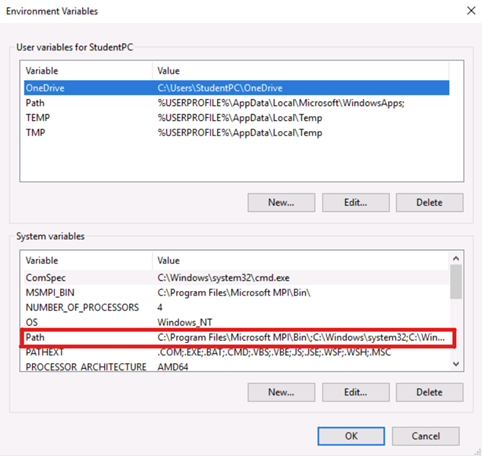
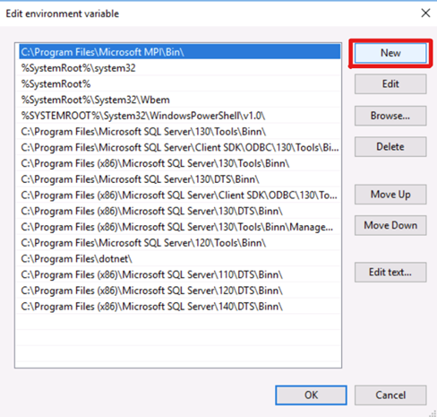
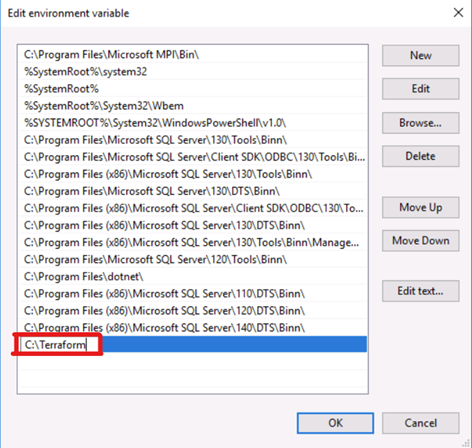
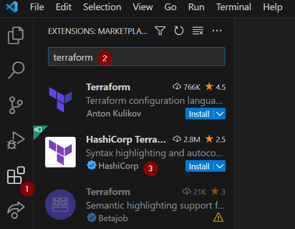

# Infrastructure as Code with Terraform on Azure – Lab Guide

## Lab1 – Terraform Environment

**Purpose** – Prepare & Initiate the Terraform environment

**Steps:**

1. Download and install the following software:
   - [VSCode](https://code.visualstudio.com/download)
   - [AzCLi](https://docs.microsoft.com/en-us/cli/azure/install-azure-cli)

2. Download and place Terraform executable in PATH:
   - Download the terraform exe from [here](https://www.terraform.io/downloads.html)
   - Extract the exe file into a new folder, for example: “C:\Terraform”
   - Hit start, search for “Environment Variables”
   - Choose “edit the system environment variables”:
   
     
     
   - Click “Environment Variables”:
   
     
     
   - Under “System variables” double click “Path”:
   
     
     
   - Click “New”:
   
     
     
   - Type the path to the new folder you created:
   
     
     
   - Click OK all the way out
   
3. Create another folder for your terraform coding environment. for example: “C:\TerraformConfiguration"

4. Open VS Code

5. Click file → open folder and choose the folder you just created

6. Install the Terraform extension:
   - Go the the extensions page on the left
   - Search for “terraform”
   - Install the one from Hashicorp
   
     
     
7. Back to the files view – create a new file and call it “providers.tf”

8. Configure the AzureRM provider and the “terraform” block with the required providers block (you can use the slide deck for reference or [this link](<link>))

9. After configuring your providers, run `terraform init`

10. Check yourself:
    - Did you get a green output?
    - Do you now have a .terraform folder in your environment?
    - Do you have a terraform.lock.hcl file
